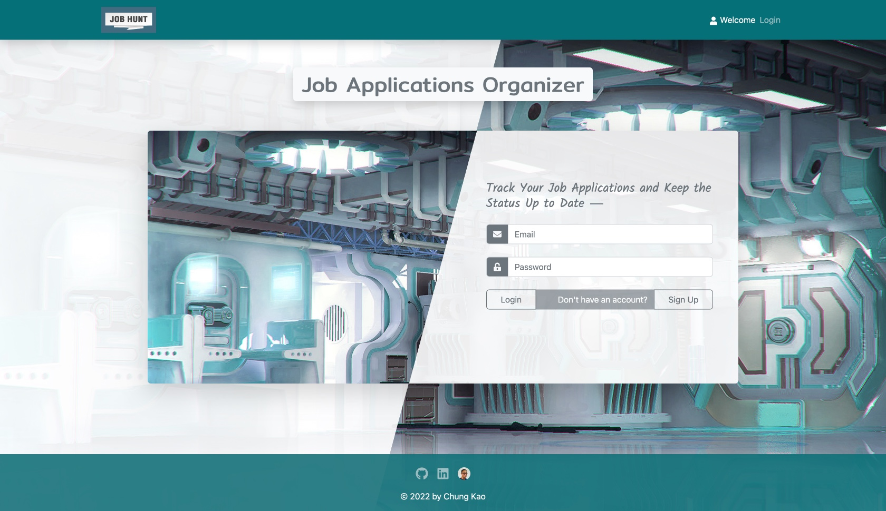
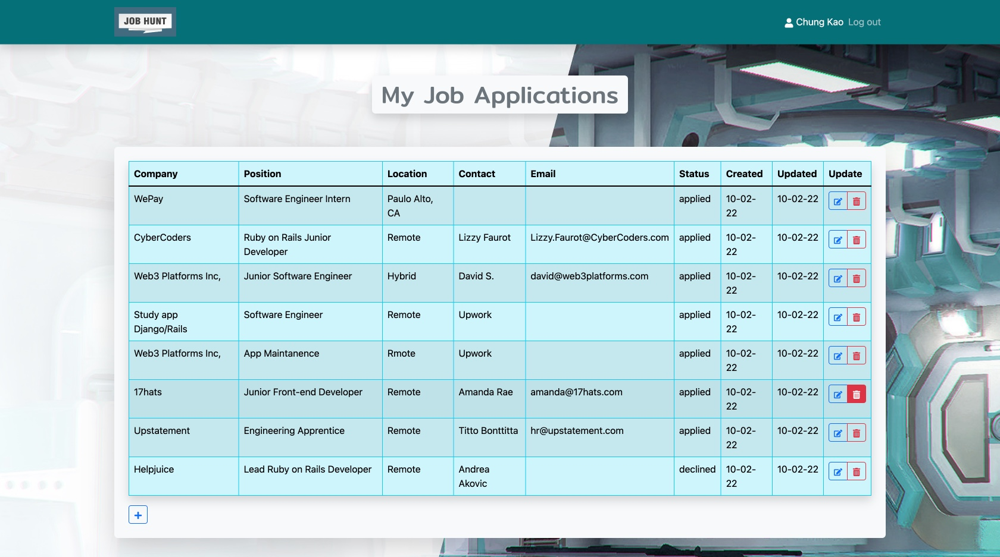
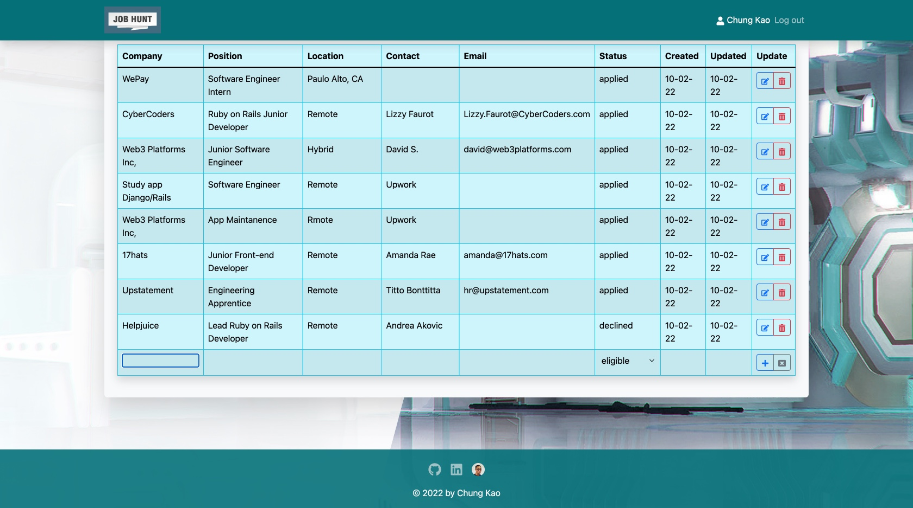
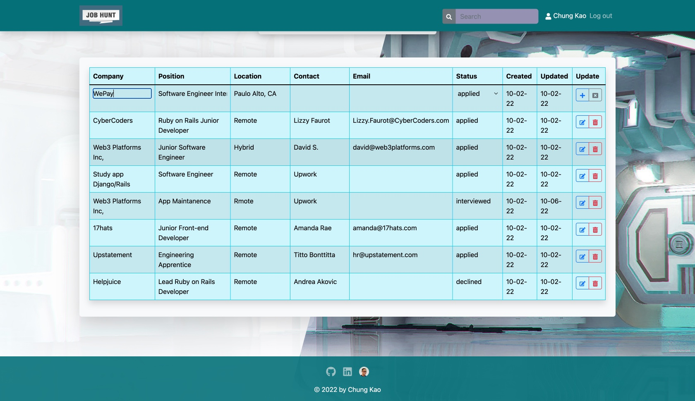
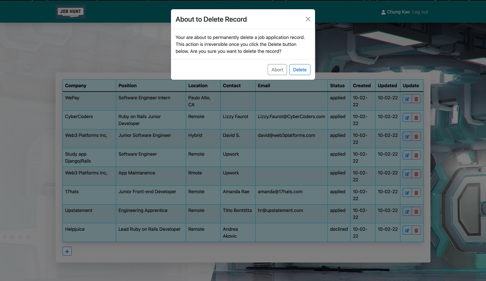

<h2 align="center">Job Hunt App</h2>
<p align="center"></p>
<h4 align="center">A Personal Job Application Organizer-Tracker</h4>
<p align="center">for Code the Dream, Orange Alpaca 2022</p>

    

<p align="left"></p>
## About

Job Hunt, a job application oraganizer-tracker, is a MERN stack web app completed to fulfill the requirement of the Code the Dream School, Orange Alpaca Node.js/Express full-stack curriculum. The app uses Node.js and the Express framework for back-end api and MongoDB for data storage. A React.js front end bootstrapped with `create-react-app` serves to interact with the client.

This repo contains the development version of the app subject to further revisions and improvements and may be cloned for such purposes or simply for fun. All suggestions and PRs are welcome. The production version of the app is served from Heroku for the back end and Firebase for the React front end.

The following assumes you're using MacOS or Linux, and have Node.js installed (which comes with NPM package manager). For Windows users or those who use yarn or other package managers please use the equivalent commands.

### Installation

Clone or fork from this repo as you like to tweak and add features to the app. You may push a branch back here to give me feedback on how the app can be taken further. You can also clone the app to use it personally in your browser. To clone a copy of the app using https run:

```
$ git clone https://github.com/Sanlung/ctd-job-hunt.git
```

or using ssh run

```
$ git clone git@github.com:Sanlung/ctd-job-hunt.git
```

Once you have cloned the repo, in your local project's root directory run:

```
$ npm install
```

which will install the packages necessary for running React on the front end. You need to run in the `/server` directory again:

```
$ npm install
```

to install the packages necessary for the Express server on the back end.

In development mode you may run:

```
$ npm run dev
```

in the `/server` directory and run the same command again in the root directory, because React and the Express server need to run separately on different ports: one on port localhost:3001 (Express) and the other port localhost:3000 (React) in this instance. Optionally, you may run the

```
$ npm start
```

command at the root directory, and it will build the React app first and then start the Express server that serves it, on the same port localhost:3001.

The app has minimalist appearance and interface that allows the user to record job application information on a table, by clicking on the add (✚) button on the bottom left of the table:

<p></p>

that will create a new table row which cells take input of the job information that may then be submitted via the add button to the right of the row:

<p></p>

To edit job information, click on the edit (pen) button to the right of the record row, which will convert the cells of the row into input fields in which the record can be edited and submitted by clicking on the add button to the right of the row.

<p></p>

To delete a record, click on the delete (trash can) button to the right of the row. A dialog box will show up asking for confirmation and delete action.

<p></p>

The app is completed in two weeks upon an intorductory course on Node.js/Express server api. Further implementation of features such as search, sort and filter of the table data could be expected to follow. Please let me know of any bugs or imperfactions. Your input will be greatly appreciated.

### Contributor

[](https://github.com/Sanlung)

### License

MIT license
