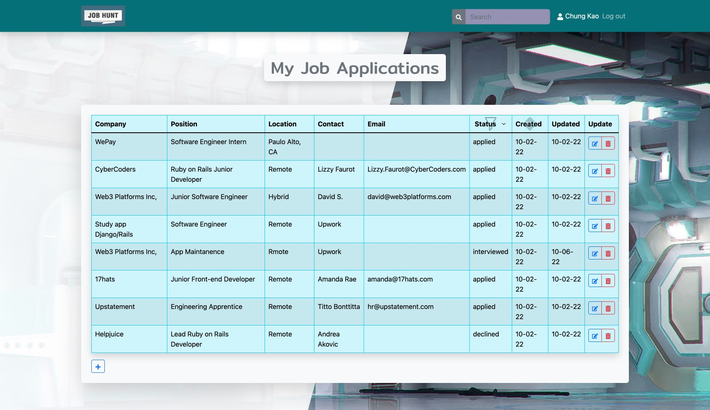
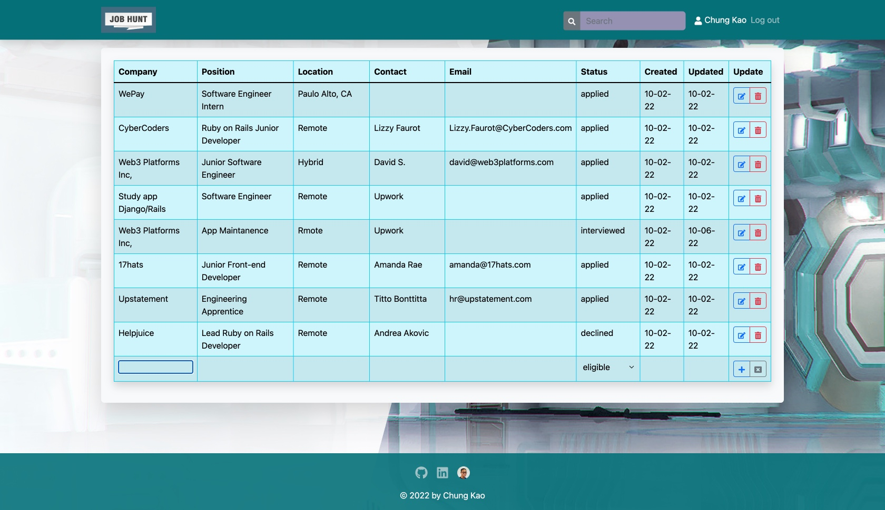
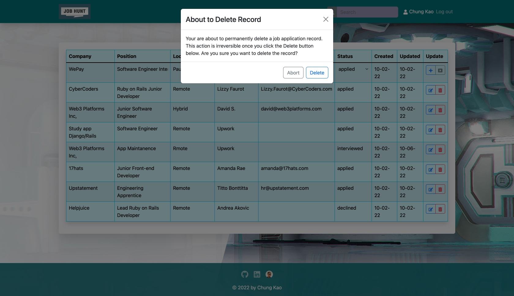
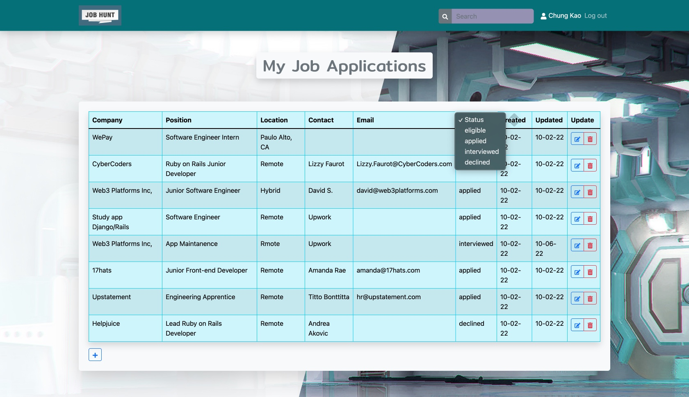

<h2 align="center">Job Hunt App</h2>
<p align="center"></p>
<h4 align="center">A Personal Job Application Organizer-Tracker</h4>
<p align="center">for Code the Dream, Orange Alpaca 2022</p>

    

<p align="left"></p>

## About

Job Hunt, a job application oraganizer-tracker, is a MERN stack web app completed to fulfill the requirement of the Code the Dream School, Orange Alpaca Node.js/Express full-stack curriculum. The app uses Node.js and the Express framework for back-end api and MongoDB for data storage. A React.js front end bootstrapped with Create React App serves to interact with the client.

This repo contains the development version of the app subject to further revisions and improvements and may be cloned for such purposes or simply for fun. All suggestions and PRs are welcome. The production version of the app is served from Heroku for the back end and Firebase for the React front end.

The following assumes you're using MacOS or Linux, and have Node.js installed (which comes with NPM package manager). For Windows users or those who use yarn or other package managers please use the equivalent commands.

### Installation

Clone or fork from this repo as you like to tweak and add features to the app. You may push a branch back here to give me feedback on how the app can be taken further. You can also clone the app to use it personally in your browser. To clone a copy of the app using https run:

```
$ git clone https://github.com/Sanlung/ctd-job-hunt.git
```

or using ssh run

```
$ git clone git@github.com:Sanlung/ctd-job-hunt.git
```

Once you have cloned the repo, in your local project's root directory run:

```
$ npm install
```

which will install the packages necessary for running React on the front end. Then create a `.env` (or `.env.local`) file in the root directory, in which you include reference to the REACT_APP_BASE_URL, for example, http://localhost:3001 while in development for the Express server's localhost port.

```.env
REACT_APP_BASE_URL=http://localhost:3001
```

You then need to run the install command in the `/server` directory again:

```
$ npm install
```

to install the packages necessary for the Express server on the back end.

The app uses MongoDB database, which you may opt for a local instance or the [MongoDB Cloud](https://cloud.mongodb.com/). For the latter you then need to create a MongoDB account and a new project, and include the project credential in a `.env` file in the `/server` directory, in which you should also include a JWT_SECRET needed for the Express server, like so:

```.env
MONGODB_URI=<your_mongodb_access_token>
JWT_SECRET=<any_long_hash_string>
JWT_EXPIRY=<e.g.,time_in_seconds>
```

With the above set-up in place and for develpment purposes, you can then run:

```
$ npm run dev
```

in the `/server` directory and run the same script again in the root directory, because React and the Express server need to run separately on different ports in develpment: one on port localhost:3001 (Express) and the other port localhost:3000 (React) in this instance. Optionally, you may run the

```
$ npm start
```

script at the root directory, and it will first build the React app into a `/build` folder at the root directory and then start the Express server that serves it, on port localhost:3001.

### Usage

The app has minimalist appearance and interface that allows the user to record job application information on a table, by clicking on the add (✚) button on the bottom left of the table:

<p></p>

that will create a new table row which cells take input of the job information that may then be submitted via the add button to the right of the row:

<p></p>

To edit job information, click on the edit (pen) button to the right of the record row, which will convert the cells of the row into input fields in which the record can be edited and submitted by clicking on the add button to the right of the row.

<p></p>

To delete a record, click on the delete (trash can) button to the right of the row. A dialog box will show up asking for confirmation and delete action.

<p></p>

The app also provides functionalities as follows:

- Use the search box on the navbar to search all fields of the records for a term.
- Click on the Status table heading to select an item from the dropdown manual to filter the records by status.
- Click on the Created table heading to sort by the dates on which the records were created, and repeat to toggle chronologically.

<p></p>

### Testing

Create React App comes out of the box with Jest as its test runner and React Testing Library for component testing. As Jest is already included in the project (i.e., in the root `/node_modules`), it is used as the server-side test runner as well with the SuperTest library for testing the api calls.

### Suggestions

The app is completed in two weeks upon an intorductory course on Node.js/Express server api. Please let me know of any bugs or imperfections. Your input will be greatly appreciated.

### Contributor

[](https://github.com/Sanlung)

### License

MIT license
